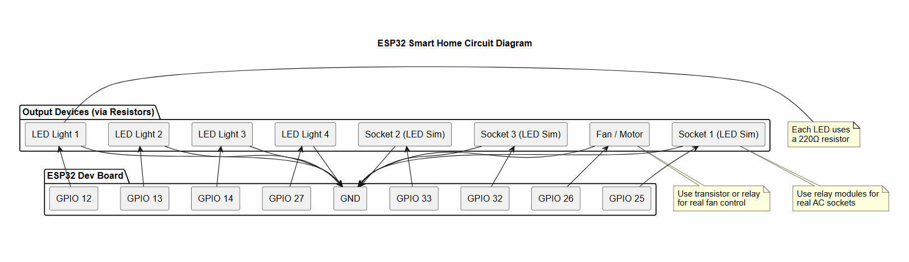

#  ESP32 Smart Home Automation System

A Wi-Fi-based smart home system built using the ESP32 microcontroller, allowing users to control lights, sockets, and appliances through a web interface.

---

##  Features

* Control multiple devices remotely via browser
* Built-in web server hosted on ESP32
* No cloud dependency (fully local network)
* Scalable architecture for additional devices
* Clean and responsive user interface

---

## Tech Stack

* **Hardware:** ESP32 Dev Board
* **Programming:** Arduino (C++)
* **Networking:** Wi-Fi (HTTP Web Server)
* **Frontend:** HTML, CSS (embedded)

---

##  System Architecture



* ESP32 acts as a web server
* Devices connected via GPIO pins
* Controlled through HTTP requests

---

##  Hardware Components

* ESP32 Dev Module
* LEDs (used to simulate lights and sockets)
* Resistors (220Ω)
* Breadboard & jumper wires
* Optional: Relay modules for real appliances

---

## How It Works

1. ESP32 connects to Wi-Fi
2. Hosts a local web server
3. User accesses IP address in browser
4. Clicking buttons sends HTTP requests
5. GPIO pins toggle devices ON/OFF

---

##  Project Structure

* `code/` → ESP32 source code
* `images/` → diagrams and UI screenshots
* `docs/` → technical documentation
* `hardware/` → wiring and components

---

## Setup Instructions

1. Install Arduino IDE
2. Add ESP32 board support
3. Open `code/smart_home.ino`
4. Update Wi-Fi credentials:

   ```cpp
   const char* ssid = "YOUR_WIFI";
   const char* password = "YOUR_PASSWORD";
   ```
5. Upload to ESP32
6. Open Serial Monitor → get IP address
7. Open IP in browser

---

## Future Improvements

* Add authentication (login system)
* Mobile app integration
* Real-time status updates (AJAX/WebSockets)
* Integration with IoT platforms (MQTT/Firebase)

---

## Author
Warran Ganyani

Warran Ganyani
Aspiring Software & IoT Engineer


